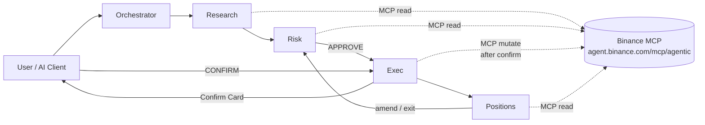

# Agent Desk · Binance Agent OS Mini Hackathon (Track A)

**EN** · Multi-agent trading desk on Binance MCP — research, risk, confirm-to-exec, positions. Not a full trading app; not a pure CLI terminal.

**中文** · 基于 Binance MCP 的多智能体交易台：研究 → 风控 → 确认后执行 → 持仓监控。不是完整交易 App，也不是纯命令行终端。

| | |
|---|---|
| Track | **A — Agent Desk** |
| Repo | https://github.com/sslisen/BN-Agent |
| MCP | `https://agent.binance.com/mcp/agentic` |
| Deadline | **2026-09-09 07:59 UTC+8** |

---

## What it is / 这是什么

**EN:** Agent Desk wires four skills — Research, Risk, Exec, Positions — so an AI client can use Binance’s **agentic** MCP with OAuth (no local API keys). Every place/cancel/transfer needs **user confirmation**. Agentic sub-account: **no external withdrawals**.

**中文：** Agent Desk 将四个技能（研究、风控、执行、持仓）串成流水线，供 AI 客户端通过 Binance **Agentic** MCP（OAuth，无本地 API Key）协作。下单/撤单/划转均需**用户确认**。Agentic 子账户：**不支持对外出金**。

---

## Architecture / 架构



Skills live in [`skills/`](./skills/): `research.md` · `risk.md` · `exec.md` · `positions.md` · `orchestrator.md`.

---

## Connect MCP / 连接 MCP

Remote **Streamable HTTP / HTTP MCP** at `https://agent.binance.com/mcp/agentic` (OAuth; not stdio; not API keys).  
Official docs: [Binance Agent Native · MCP Server](https://developers.binance.com/en/docs/agent-native/mcp-server)

See [`docs/mcp-setup.md`](./docs/mcp-setup.md) or run `./scripts/print-mcp-install.sh`.

```bash
# Claude Code
claude mcp add --transport http binance-agentic https://agent.binance.com/mcp/agentic

# Cursor — .cursor/mcp.json (or ~/.cursor/mcp.json):
# { "mcpServers": { "binance-agentic": { "url": "https://agent.binance.com/mcp/agentic" } } }
# then reload + OAuth

# Codex
codex mcp add binance-agentic --url https://agent.binance.com/mcp/agentic

# VS Code — add HTTP server URL https://agent.binance.com/mcp/agentic in MCP settings

# Grok Bot — add HTTP MCP "binance-agentic" → https://agent.binance.com/mcp/agentic (OAuth)
```

---

## Showcase / 展示站

Dark crypto landing (Next.js App Router + TypeScript + Tailwind):

```bash
cd apps/showcase && npm i && npm run build
# optional: npm run start
```

---

## Demo script (6 beats) / 演示六拍

Full text: [`docs/demo-script.md`](./docs/demo-script.md)

1. **Connect** — OAuth MCP, desk online  
2. **Research** — brief for a liquid pair  
3. **Risk** — sized ticket + APPROVE  
4. **Confirm place** — Confirm Card → user CONFIRM → order  
5. **Positions** — snapshot / alerts  
6. **Confirm cancel/exit** — Confirm Card → cancel/flatten  

---

## Safety & eligibility / 安全与准入

- OAuth only; no API keys in the repo  
- Confirm every trade / cancel / transfer  
- No external withdrawals on agentic sub-account  
- **Restricted regions may include SG / US / UK / EEA / HK** (and others). **Not legal advice** — follow Binance ToS and local law.

---

## Hackathon deadline

Submit before **2026-09-09 07:59 UTC+8**.

MIT © 2026 sslisen
